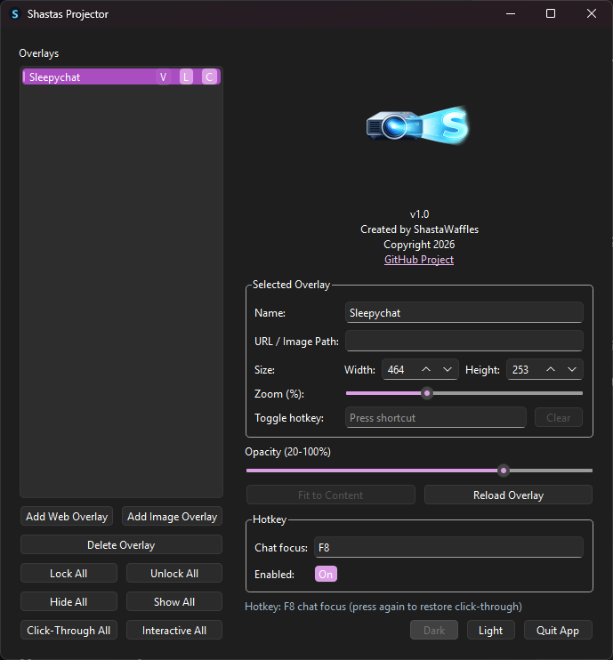
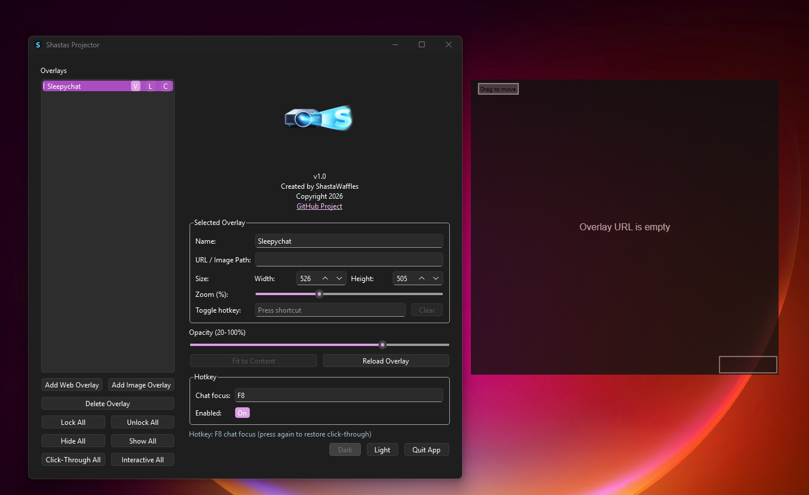
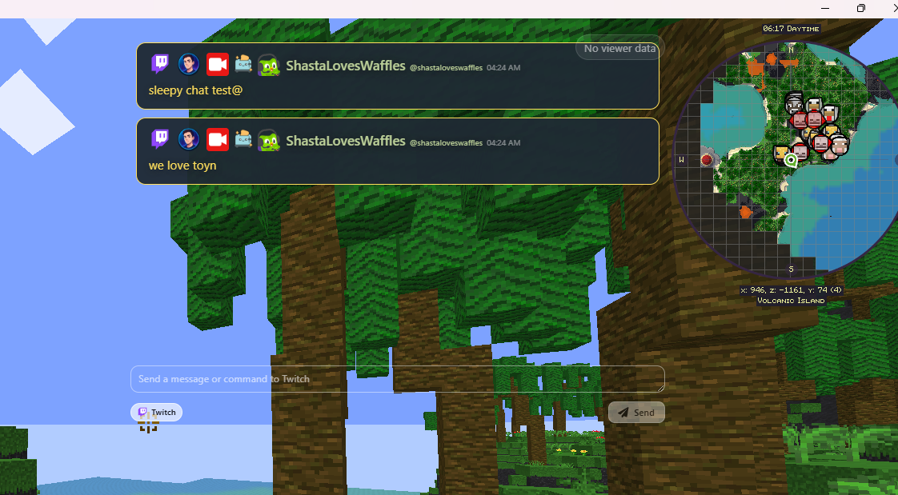

# Shasta's Projector (v1.0)

A cross-platform desktop overlay app for streamers who want chat and visual widgets **on top of their game** without keeping a browser open.

Built for streamers who play in borderless or windowed fullscreen and want a lightweight, always-on-top overlay that stays out of the way during gameplay.


Github: https://github.com/ShastaWaffles/Shastas-Projector/

---

## Features

- Multiple overlays (web or image)
- Per-overlay controls:
  - Name
  - Source
  - Size
  - Opacity
  - Zoom
  - Lock
  - Visibility
  - Click-through
- Per-overlay global hotkey to show/hide
- Global chat-focus hotkey (customizable + enable/disable)
- Click-through mode for gameplay
- Lock mode hides drag/resize chrome
- System tray support (hide/show/quit from tray menu)
- Light and dark control panel themes
- Persistent config (overlays + settings saved per user)

---

## Best Use for Streamers

This app is designed for **borderless or windowed fullscreen** workflows so chat and overlays can stay visible over games.

⚠️ **Important:**  
True **exclusive fullscreen** in some games (including Minecraft) can bypass desktop overlays due to OS/GPU behavior.  
For reliable overlays, use **borderless** or **windowed fullscreen** modes.

---

## Screenshots / Demo








---

## Requirements

- Python 3.10+ (3.11+ recommended)
- Dependencies listed in `requirements.txt`

---

## Local Run

```bash
pip install -r requirements.txt
python -m overlay_app.app
```

## Controls

- Close (X) on control panel: hides to tray (app keeps running)
- Tray icon:
  - Open Control Panel
  - Hide Control Panel
  - Quit
- `Quit App` button in control panel fully exits the app

## Packaging (PyInstaller)

Build on each OS natively:
- Windows build on Windows
- macOS build on macOS
- Linux build on Linux

Install build tooling:

```bash
pip install -r requirements.txt pyinstaller
```

### Windows

```powershell
pyinstaller --name "ShastasProjector" --windowed --onedir `
  --icon overlay_app/resources/projectoricon.png `
  --add-data "overlay_app/resources;overlay_app/resources" `
  -m overlay_app.app
```

### macOS / Linux

```bash
pyinstaller --name "ShastasProjector" --windowed --onedir \
  --icon overlay_app/resources/projectoricon.png \
  --add-data "overlay_app/resources:overlay_app/resources" \
  -m overlay_app.app
```

Output is created in `dist/ShastasProjector/`.

## Project Structure

```text
overlay_app/
  app.py
  models/
  overlays/
  ui/
  resources/
```

## License

MIT License

Copyright (c) 2026 ShastaWaffles

Permission is hereby granted, free of charge, to any person obtaining a copy
of this software and associated documentation files (the "Software"), to deal
in the Software without restriction...

